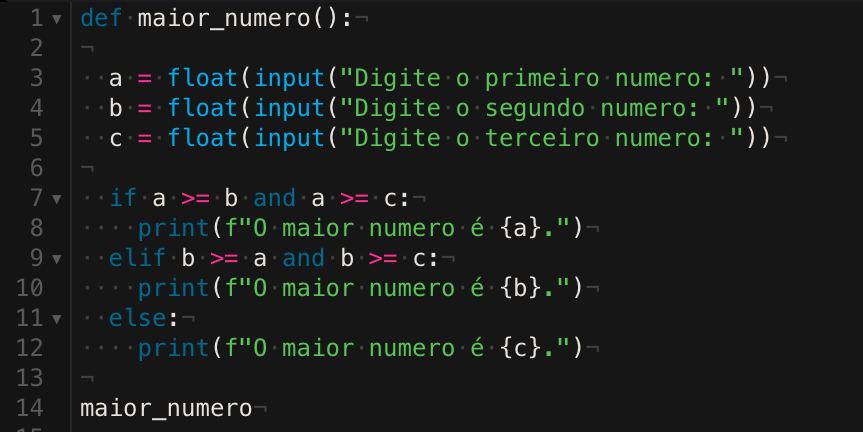

# VERIFICADOR DE MAIOR NUMERO

PROJETO: Uma função que pede para o usuario três numeros, cada numero por vez, depois compara os três numeros e dar a resposta de qual o maior numero dentre os três.

## LINGUAGEM UTILIZADA

1. PYTHON

## PARA QUE FOI FEITO

Foi feito para avaliação pessoal e para ser implementado a nota ao final do curso no modulo de python.

## AUXILIOS

Projeto feito com auxilio de IA e [StackOverflow](https://stackoverflow.com).

## IMAGEM DO CODIGO

